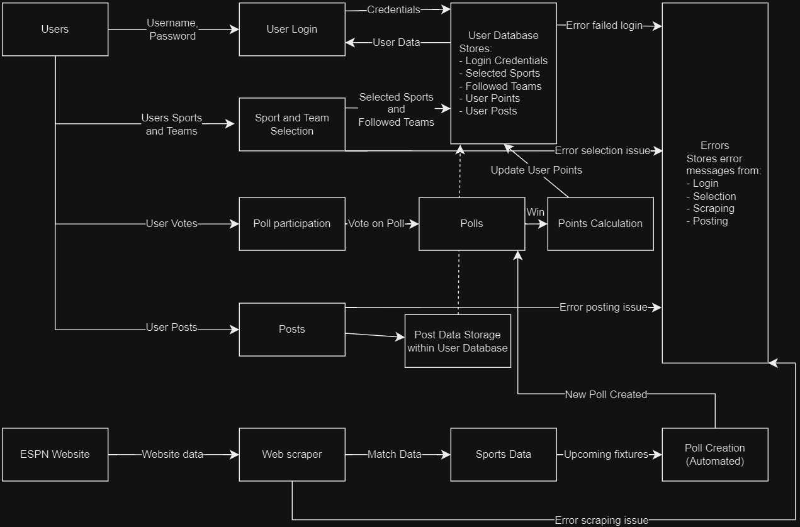
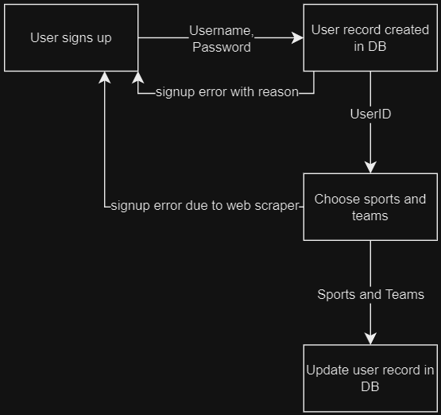
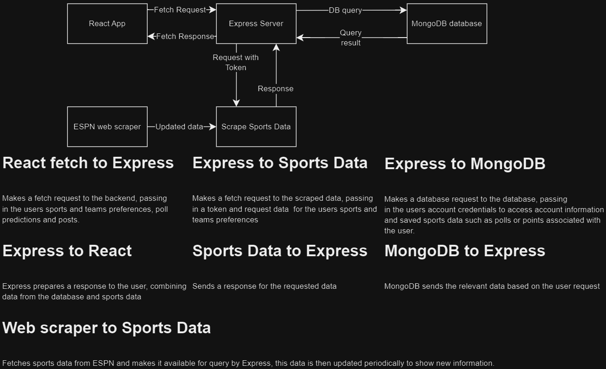

# T3A2 Full Stack Application

## Website Description
### Purpose
The purpose of my web app is to connect sports fans purely based on which sports they follow and which teams they support. As an avid sport enthusiast I find the current platforms aren't so much connecting people as producing content providing no opportunity for people to connect purely from their love of sport and any app already made for each sport is drowning in gambling advertisements and terrible sensationalised journalism.

My app will solve these issues for sports fans by bringing back the simple love of sport shared between fans.

### Functionality
This app will have a user log in to an account, select which sports they enjoy and any teams they may follow from those sports they've selected. The app will then connect them to other enthusiasts of the sport and allow them to post about upcoming matches and participate in polls on head to head fixtures for bragging rights that will add points to their account if they happen to be correct.

### Target audience
Any and all sports enthusiasts that just want to connect through their love of sport.

### Tech stack
- JavaScript
- React
- Node
- Nodemon
- Express
- MongoDB
- Python (ESPN web scrapper bot)
- Monday.com
- Figma
- Draw.io

## Dataflow Diagram

## Application Architecture Diagram

## User Stories

## Wireframes

## Project boards screenshots
Screenshot 15 Jul 24

