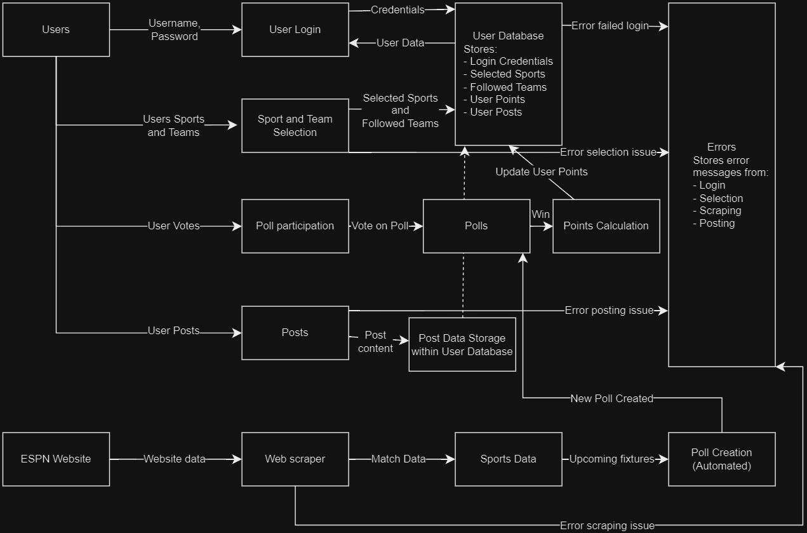

# T3A2 Full Stack Application

## Website Description
### Purpose
The purpose of my web app, BenchWarmer, is to connect sports fans purely based on which sports they follow and which teams they support. As an avid sport enthusiast I find the current platforms aren't so much connecting people as producing content providing no opportunity for people to connect purely from their love of sport and any app already made for each sport is drowning in gambling advertisements and terrible sensationalised journalism.

BenchWarmer will solve these issues for sports fans by bringing back the simple love of sport shared between fans.

### Functionality
BenchWarmer will have a user log in to an account, select which sports they enjoy and any teams they may follow from those sports they've selected. BenchWarmer will then connect them to other enthusiasts of the sport and allow them to post about upcoming matches and participate in polls on head to head fixtures for bragging rights that will add points to their account if they happen to be correct.

### Target audience
Any and all sports enthusiasts that just want to connect through their love of sport.

### Tech stack
- JavaScript
- React
- Node
- Nodemon
- Express
- MongoDB
- Python (ESPN web scrapper bot)
- Monday.com (Project management)
- Figma (Wireframes)
- Draw.io (DFD and AAD)

## Dataflow Diagram

## Application Architecture Diagram

## User Stories
### User Story 1 (Revised):
**Persona:** Sarah, the Anti-Gambling Fan

**What:** Sarah wants to engage with a sports social media platform that is free from gambling advertisements and promotions.

**Why:** Sarah enjoys connecting with other sports fans and discussing games, teams, and athletes. However, she finds gambling ads intrusive and distracting, and they detract from the pure enjoyment of sports for her. She seeks a safe and positive online sports community focused on genuine fan interaction. (Revised to emphasize Sarah's desire for a gambling-free environment)

### User Story 2 (Revised):
**Persona:** Michael, the Purist Fan

**What:** Michael wants to connect with other sports fans who share his deep passion for the intricacies and strategies of the game, away from the noise of clickbait headlines and sensationalist reporting.

**Why:** Michael enjoys thoughtful discussions about sports tactics, player performances, and the technical aspects of the game. He finds mainstream sports media often focuses on sensational stories and drama to attract viewers, which he finds off-putting. He seeks a community where fans can engage in meaningful conversations about their shared love for the sport itself. (Revised to focus on Michael's desire for in-depth discussions and avoiding clickbait journalism)

### User Story 3 (Revised):
**Persona:** Alice, the Competitive Fan

**What:** Alice wants to see past poll results and compare them to actual game outcomes to track her prediction accuracy and potentially earn bragging rights among her friends.

**Why:** Alice enjoys the thrill of predicting game winners and using her sports knowledge to gain an edge over her friends. By viewing past poll results and how they align with real-world outcomes, she can analyse her past predictions, identify areas for improvement, and ultimately aim to boast the best track record in her social circle. (Revised to focus on Alice's desire to use past polls for bragging rights and improve her prediction skills)

## Wireframes
**Signup Page:**

Accessed by default without logging in

**Home Page:**

Accessed by default after login/signup and by clicking on the BenchWarmer logo

**Profile Page:**

Accessed through clicking on a persons profile

**Settings Page:**

Accessed through the Menu in Tablet/Phone view and Profile Drop Down in Desktop view 

## Project boards screenshots
Screenshot 15 Jul 24

Screenshot 16 Jul 24

Screenshot 17 Jul 24

